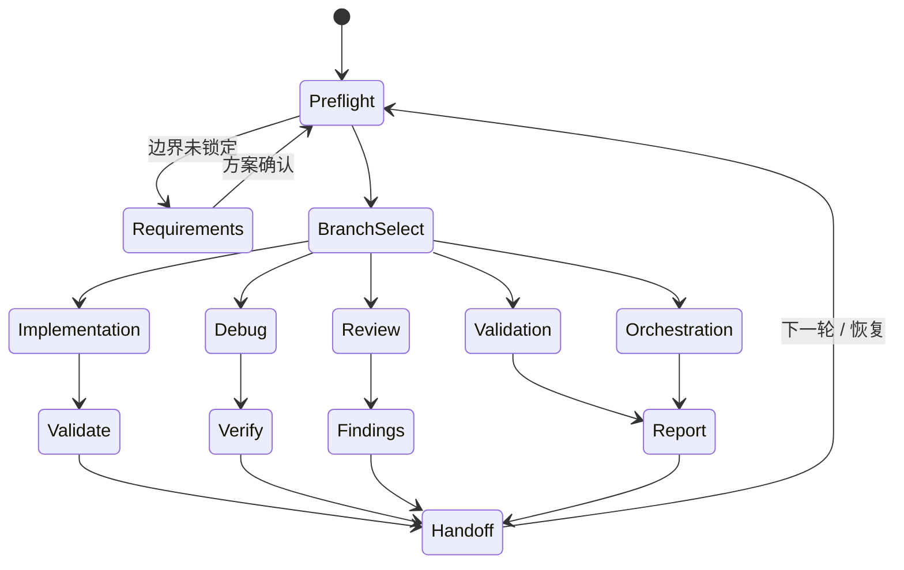

# AIBridge Loops 与 FSM 分析

## 结论

AIBridge 不是单层 prompt loop，而是三层叠加的状态系统，外加一层运行摘要视图：

1. 入口层：`Preflight / Skill 路由` -> 分支选择 -> 模式进入 -> 模式执行 -> 模式退出 / 交接 -> Transition Preflight
2. 运行层：`terminalState`、`terminalReason`、`retryBudget`、`stopWhen`、`loopIteration`，以及 `phase / step / gate / artifact / report`
3. 求解层：`观察 -> 假设 -> 证伪 -> 单点修复 -> 验证 -> 继续或结束`

所以，你说的“分支流转本质上是 FSM”基本成立。AIBridge 的 loop 不是靠隐式记忆转圈，而是靠显式状态、显式转移和显式证据留痕推进；`WorkflowRunSummary` 还把 iteration、freshness、external handoff gap 和 verdict 统计显式写出来了。

## 和官方 loop 观念的对应

| 官方概念 | 重点 | AIBridge 对应 |
|---|---|---|
| OpenAI agent loop | 观察、工具调用、再观察、再修正 | workflow run + artifact + gate + report |
| OpenAI goal / iteration | 目标明确、验证驱动、可持续迭代 | `bug-hunter-loop`、`runtime-debug-investigation` |
| OpenAI subagents | 专业化并行角色、结果汇总 | `agent` / `manual` step + structured import |
| Claude Code `/loop` | 持续执行、快速轮询、适合长任务 | active-run、resume、status/report/finish |
| Claude Code hooks / skills | 生命周期事件与可复用工作流 | `Skill`、`SkillHandoff`、phase/step 入口状态 |

## AIBridge 里 loop 的真实形态

### 1. Preflight / Skill 路由

先判断当前任务属于哪个主分支，再决定要加载哪些 Skills。它是入口状态，不是业务模式本身；默认只作为内部路由，不要求单独对用户输出。

### 2. 分支选择

`implementation`、`debug`、`review`、`validation`、`orchestration` 这几类分支，已经很接近 FSM 的一级状态。

### 3. recipe 执行

Recipe 不是“把 prompt 循环一遍”，而是带有顺序、依赖、可恢复 run、artifact、gate 的有限状态流程。

### 4. 证据与门禁

`compile unity`、`get_logs`、`runtime status`、`screenshot`、`test run` 这类 gate 把 loop 的推进条件显式化了。`test run` 现在还能把并发请求队列持久化到 `.aibridge/test-runs/state.json`，但如果已确认的 run 在重载后丢失，状态会收口成 `unknown`，避免无限等待。

### 5. 交接与恢复

`SkillHandoff`、`active-run`、`workflow status`、`workflow import`、`workflow finish` 让 loop 可以跨 turn 延续，而不是只能在单次对话里完成。

### 6. 运行摘要

`WorkflowReportWriter` / `WorkflowRunSummary` 已经能回读 `iterationCount`、`externalSkippedCount`、`missingExternalImportCount`、`freshEvidenceCount`、`staleEvidenceCount`、`missingEvidenceCount`、`unknownEvidenceCount`、`confirmedVerdictCount`、`refutedVerdictCount`、`uncertainVerdictCount` 和 `openRiskCount`。

所以，这里不该再写成“缺少 metrics”，更准确的说法是：metrics 已经落地，但 `stopWhen`、`retryBudget`、`terminalState` 和 `terminalReason` 的语义还需要统一到所有 recipes。

## 现在已经做得好的地方

- 状态边界清晰，分支不是靠隐式语义猜测。
- 证据先行，尽量用 artifact 和 gate 推动下一步。
- `parallel read / serial write` 的约束是对的，适合真实工程。
- `run`、`resume`、`import`、`finish` 形成了完整闭环。
- `WorkflowReportWriter` 已经把 iteration、fresh/stale evidence、external import gap 和 verdict counts 摆出来，loop 的可观测性已经成形。
- `bug-hunter-loop` 已经是一个很典型的“观察 -> 假设 -> 证伪 -> 修复 -> 验证”循环。

## 不足和可优化点

1. `agent` / `manual` 步骤依赖外部执行器，AIBridge 本身不是真正的多 Agent runtime。
2. 终止条件分散在 recipe 里，缺少统一的 terminal taxonomy。
3. 证据新鲜度、重复采样和 stale evidence 还不够像一等公民。
4. 并行写入的 ownership / merge contract 还是偏规则说明，不是强约束模型。
5. loop metrics 已经出现，但 `stopWhen` / `retryBudget` / `loopIteration` 的作者约束和默认语义还没有统一到所有 recipes。
6. 缺少机器可验证的状态图输出，FSM 是“可读的”，但还不够“可验证”。
7. `run-cli` 会跳过 `agent` / `manual`，如果外部结果没回流，loop 的完整性会被静默破坏。

## 值得补的东西

- 统一 recipe loop contract：`objective`、`observe`、`act`、`verify`、`stopWhen`、`retryBudget`
- 统一终态：`success`、`blocked`、`stale`、`needs-human`、`external-handoff`
- 让 `terminalState`、`terminalReason`、`loopIteration` 的词表在 recipe、manifest 和 report 中保持一致
- 给每个 phase / step 增加更明确的 freshness 和 retry 语义
- 在 report 里继续保留 loop metrics 和未闭合外部步骤
- 生成可视化 state graph，避免流程只存在于文字里
- 对 `agent` / `manual` import 做 completeness check，防止“看起来完成了，实际上没回流”
- 对并行写入增加 ownership / merge manifest，减少多人或多 agent 冲突

## 最终判断

AIBridge 已经很接近“理想的 loops + FSM”实现了。它的强项是可恢复、可验证、可留痕。它现在不是“缺 loop metrics”，而是“metrics 已经存在，但终止语义和词表还没完全统一”的受约束工作流状态机。

后续优化重点不在于把它做得更像一个统一调度器，而在于把终止语义、证据新鲜度、外部执行器回流和状态图可视化做得更硬。

## 资料

### 官方资料

- OpenAI: [Running agents](https://developers.openai.com/api/docs/guides/agents/running-agents)
- OpenAI: [Follow a goal](https://developers.openai.com/codex/use-cases/follow-a-goal)
- OpenAI: [Iterate on difficult problems](https://developers.openai.com/codex/use-cases/iterate-on-difficult-problems)
- OpenAI: [Subagents](https://developers.openai.com/codex/subagents)
- Anthropic: [Claude Code tool use overview](https://docs.anthropic.com/en/docs/build-with-claude/tool-use/overview)
- Anthropic: [Claude Code common workflows](https://docs.anthropic.com/en/docs/claude-code/common-workflows)
- Anthropic: [Claude Code hooks](https://docs.anthropic.com/en/docs/claude-code/hooks)
- Anthropic: [Claude Code skills](https://docs.anthropic.com/en/docs/claude-code/skills)

### AIBridge 本地参考

- `README.md`
- `Doc~/README.md`
- `Tools~/AIBridgeCLI/Workflow/WorkflowModels.cs`
- `Tools~/AIBridgeCLI/Workflow/WorkflowValidator.cs`
- `Tools~/AIBridgeCLI/Workflow/WorkflowPlanWriter.cs`
- `Tools~/AIBridgeCLI/Workflow/WorkflowRunInsight.cs`
- `Tools~/AIBridgeCLI/Workflow/WorkflowReportWriter.cs`
- `Skill~/aibridge-development-workflow/references/branch-selection.md`
- `Skill~/aibridge-workflow-orchestration/references/orchestration-patterns.md`
- `Templates~/Workflows/bug-hunter-loop.aibridge-workflow.json`
- `Templates~/Workflows/runtime-debug-investigation.aibridge-workflow.json`
- `Templates~/Workflows/unity-change-implementation.aibridge-workflow.json`
