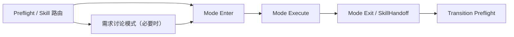

# AIBridge Workflow 设计与证据校验

完整展示页在 [index.html](./index.html)。

- 这页用于快速理解 workflow 的入口、需求讨论、模式、步骤、证据校验和交接。
- HTML 版本包含更完整的流程图、表格、方案写入策略和源码索引。
- 方案写入默认先落 `.aibridge/plan` 作为工作底稿；当方案需要流程图、对比表或更强的开发者浏览效果时，再同步到正式文档目录并生成 `html`。
- 设计依据来自 `Templates~/Workflows/*.json`、`Tools~/AIBridgeCLI/Workflow/*.cs` 和 `Doc~/WorkflowsPanel.md`。
