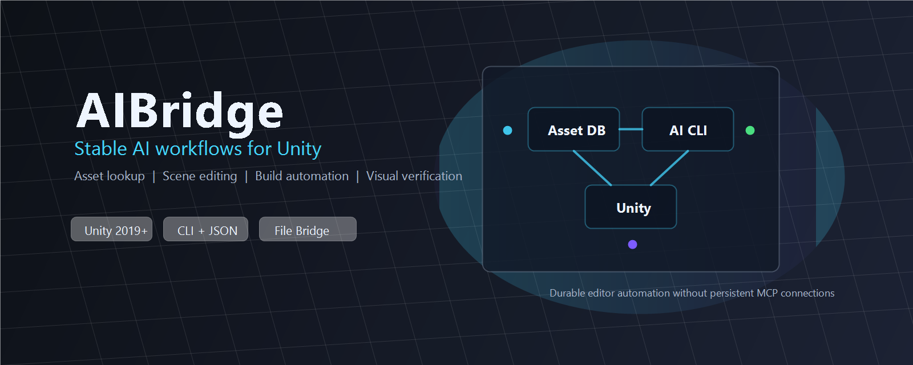

<p align="center">
  
</p>

# AIBridge

[English](./README.md) | 中文


AIBridge 是一个 Unity Package，用于在 AI 编码助手和 Unity Editor 之间建立稳定的命令桥接。它可以帮助 AI 定位资源、查看场景和 Prefab、编辑 Unity 对象、执行编译/构建检查、读取 Console 日志，并通过截图或 GIF 做视觉验证。

它面向的是希望 AI 真正参与 Unity 项目工作的团队，而不只是让 AI 生成文字建议或代码片段。

## 核心亮点

- **文件通信桥接：** 命令请求和执行结果会落盘保存，可跨编辑器重启、脚本编译和域重载继续追踪。
- **CLI 优先工作流：** 标准命令加紧凑 JSON 输出，便于 AI、脚本和自动化流程解析。
- **Unity 感知操作：** 支持资源查找、场景层级、Prefab 检查、组件属性、选择集、Transform 和菜单调用。
- **视觉验证闭环：** 内置截图和 GIF 录制，让 UI/玩法结果可以被真实画面验证。
- **AI 协作模板：** 支持安装 AGENTS.md 规则，用于 Codex、Claude、Cursor、Cline 等 AI 编码工作流。
- **可扩展命令模型：** 可新增 Unity 侧命令和 CLI Builder，不依赖持续运行的 MCP 服务。

## 为什么选择 AIBridge？

很多 Unity AI 集成依赖持续在线的 socket 或 MCP 会话。AIBridge 使用持久化命令文件和结果文件，因此能更好地应对 Unity 最容易打断工具链的时刻：重新编译、域重载、编辑器焦点变化和重启。

| 维度 | AIBridge | 持续连接型 MCP 桥接 |
|---|---|---|
| 连接稳定性 | 基于文件的请求和结果 | 依赖持续连接 |
| 编译周期适应 | 可轮询并跨重载继续 | 编译期间会话可能中断 |
| 部署成本 | 使用随包 CLI 命令即可工作 | 需要配置服务端/客户端 |
| AI 集成方式 | CLI 命令 + JSON 输出 | 需要接入特定协议工具 |
| 任务可追踪性 | 命令文件、结果文件、截图、日志 | 常依赖当前会话状态 |
| 扩展方式 | Unity 命令处理器 + CLI Builder | 多数依赖工具服务扩展 |

## 可以自动化什么？

- 修改前先定位脚本、Prefab、场景、材质、贴图或 ScriptableObject 的真实 Unity 资源路径。
- 查看场景层级、当前选择、Prefab 元信息、组件和序列化属性。
- 从自动化流程创建、重命名、删除、复制、设置父级和调整 GameObject Transform。
- 通过 Unity 序列化 API 修改组件字段，避免直接手改 YAML。
- 触发 Unity 编译，并读取真实编译结果。
- 自动化变更后读取 Unity Console 的错误和警告。
- 使用 `batch` 和 `multi` 执行多步骤编辑器脚本。
- 在 Play Mode 下捕获 Game 视图截图和 GIF。
- 设置 Game 视图分辨率，用于可重复的视觉测试。

## 安装

在 Unity Package Manager 中使用下面的 Git 地址安装：

```text
https://github.com/liyingsong99/AIBridge.git
```

你也可以直接克隆或下载本仓库，然后放到 Unity 项目的 `Packages` 目录下。

## 配置 AI 工作流

AIBridge 内置可直接使用的 AGENTS.md 工作流模板：

1. 在 Unity Editor 中打开 `Tools > AIBridge Settings`。
2. 切换到 `Skills Installation` 页签。
3. 点击 `Install AGENTS.md`。
4. 确认安装到 Unity 项目根目录。

安装后的规则包含需求确认、实施流程、Unity 编译检查、Console 诊断、C# 兼容规则和质量检查清单。

## 系统要求

- Unity 2019.4 或更高版本。
- .NET 8.0 Runtime，用于随包提供的 CLI 工具。

## CLI 命令速览

AIBridge 安装 CLI 缓存后，在 Unity 项目根目录执行命令：

```powershell
$CLI = "./AIBridgeCache/CLI/AIBridgeCLI.exe"
```

macOS/Linux 可使用随包平台 CLI，或根据项目配置通过 `dotnet` 运行 DLL。

### 资源定位

```bash
./AIBridgeCache/CLI/AIBridgeCLI.exe asset search --mode script --keyword "Player" --format paths
./AIBridgeCache/CLI/AIBridgeCLI.exe asset find --filter "t:Prefab" --format paths
./AIBridgeCache/CLI/AIBridgeCLI.exe asset get_path --guid "abc123..."
```

### 场景、选择集和 Prefab 上下文

```bash
./AIBridgeCache/CLI/AIBridgeCLI.exe scene get_hierarchy --depth 3 --includeInactive false
./AIBridgeCache/CLI/AIBridgeCLI.exe selection get --includeComponents true
./AIBridgeCache/CLI/AIBridgeCLI.exe prefab get_info --prefabPath "Assets/Prefabs/Player.prefab"
./AIBridgeCache/CLI/AIBridgeCLI.exe prefab get_hierarchy --prefabPath "Assets/Prefabs/Player.prefab"
```

### 组件检查与编辑

```bash
./AIBridgeCache/CLI/AIBridgeCLI.exe inspector get_components --path "Player"
./AIBridgeCache/CLI/AIBridgeCLI.exe inspector get_properties --path "Player" --componentName "Transform"
```

PowerShell 中传递复杂 JSON 时，建议先构造变量：

```powershell
$values = (@{ 'm_LocalPosition.x' = 0; 'm_LocalPosition.y' = 1 } | ConvertTo-Json -Compress) -replace '"', '\"'
& "./AIBridgeCache/CLI/AIBridgeCLI.exe" inspector set_properties --assetPath 'Assets/Prefabs/Player.prefab' --componentName Transform --values $values
```

### 场景对象操作

```bash
./AIBridgeCache/CLI/AIBridgeCLI.exe gameobject create --name "MyCube" --primitiveType Cube
./AIBridgeCache/CLI/AIBridgeCLI.exe transform set_position --path "Player" --x 0 --y 1 --z 0
```

### 编译、日志与自动化

```bash
./AIBridgeCache/CLI/AIBridgeCLI.exe compile unity
./AIBridgeCache/CLI/AIBridgeCLI.exe get_logs --logType Error
./AIBridgeCache/CLI/AIBridgeCLI.exe batch from_text --text "call editor log 'Hello'\ndelay 1000"
./AIBridgeCache/CLI/AIBridgeCLI.exe multi --cmd "editor log --message Step1&get_logs --logType Error --count 1"
```

`multi --cmd` 会把普通 CLI 行写成 Batch 的 `call` 行。较长脚本或复杂 JSON 命令建议使用 `multi --stdin`。

### 视觉验证

```bash
./AIBridgeCache/CLI/AIBridgeCLI.exe screenshot game
./AIBridgeCache/CLI/AIBridgeCLI.exe screenshot gif --frameCount 50
./AIBridgeCache/CLI/AIBridgeCLI.exe gameview set_resolution --width 1920 --height 1080
./AIBridgeCache/CLI/AIBridgeCLI.exe gameview get_resolution
```

## 推荐 AI 工作流程

1. 先解析真实 Unity 资源路径或对象路径。
2. 查看当前场景、Prefab、组件或序列化属性状态。
3. 通过 Unity 感知命令或源码编辑执行最小安全改动。
4. 执行 `compile unity`。
5. 读取 `get_logs --logType Error`。
6. 如果结果与画面有关，捕获截图或 GIF 做验证。

## 仓库结构

```text
Editor/        Unity Editor 命令、工具、设置窗口和集成逻辑
Runtime/       Runtime 桥接契约和轻量运行时数据
Tools~/       AIBridgeCLI 源码和随包平台二进制
Templates~/   AI 工作流规则模板
Skill~/       面向 AI 助手的 AIBridge Skill 定义
Images/       README 和宣传图片
```

## 许可证

MIT License。详见 [LICENSE](./LICENSE)。

## 贡献

欢迎提交 issue 和 pull request。修改 Unity 侧行为时，建议同步补充相关 CLI 命令示例和验证说明。
